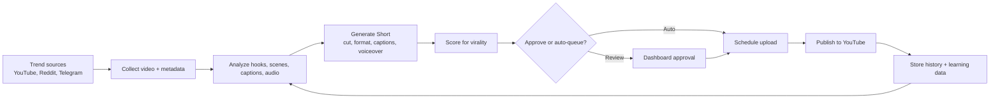

# 🚀 GhostPipe — AI YouTube Shorts Automation

> **Automate your YouTube Shorts workflow.** GhostPipe scans viral trends, generates AI-powered vertical videos, scores performance, and uploads to YouTube—fully autonomous. From trend signal to live upload, zero manual work.

---

## 🧭 What is GhostPipe?

GhostPipe is an **end-to-end Shorts production system** combining:

- 🎬 **React Dashboard** — Control panel for approvals, uploads, quotas, and logs
- 🐍 **Python Pipeline** — Automation layer for trend scanning, video generation, and publishing
- 📊 **AI Scoring** — Predict virality before upload
- ⏰ **Smart Scheduling** — Respect peak times and daily caps
- 🔒 **Safety Gates** — Copyright detection and approval workflows

Perfect for content teams, growth operators, and creators who want a repeatable Shorts engine instead of manual editing chains.

### Workflow Diagram of the Content Generation Pipeline



---

## ⚙️ Quick Start

### Prerequisites

- Node.js 20+
- Python 3.11+
- ffmpeg
- YouTube API credentials

### 5-Minute Setup

**Frontend Dashboard:**
```bash
npm install && npm run dev
# Opens http://127.0.0.1:5173
```

**Python Pipeline (separate terminal):**
```bash
python -m venv venv
source venv/bin/activate  # or .\venv\Scripts\Activate.ps1 on Windows
pip install -r pipeline/requirements.txt
python pipeline/ghostpipe_v5_1_pipeline.py
```

Login to the dashboard at `http://127.0.0.1:5173` with:
- **Email:** `operator@ghostpipe.local`
- **Password:** `ghostpipe`

---

## 🗂️ Project Structure

```text
.
├── 🗄️ config/              Configuration files and environment templates
├── 🗄️ deploy/              Docker and systemd deployment assets
│   ├── docker/             Dockerfile and docker-compose.yml
│   └── systemd/            Linux service unit
├── 🗄️ docs/                Architecture diagrams and docs
├── 🗄️ downloads/           Downloaded source videos
├── 🗄️ outputs/             Generated media and shorts
├── 🗄️ pipeline/            Python pipeline modules
├── 🗄️ public/              Dashboard static data
├── 🗄️ scripts/             Setup and utility scripts
├── 🗄️ src/                 React dashboard source
│   ├── pages/              Dashboard views
│   ├── components/         UI components
│   └── data/               State management
├── 🗄️ tests/               End-to-end tests
├── package.json            Frontend dependencies
└── vite.config.ts          Vite configuration
```

---

## 🧩 Architecture

### System Overview

```
┌─────────────────────────────────────────────────┐
│         GhostPipe Architecture                   │
├─────────────────────────────────────────────────┤
│                                                   │
│  ┌──────────────────┐         ┌─────────────┐   │
│  │   React         │         │   Python    │   │
│  │   Dashboard     │◄────────►│  Pipeline   │   │
│  │  (Vite/React)   │ HTTP API │ (v5.1)      │   │
│  └──────────────────┘         └─────────────┘   │
│         │                            │            │
│         │                            ├─ Trend Scan
│         │                            ├─ Download
│         ▼                            ├─ Generate
│    Settings                          ├─ Score
│    Approvals                         ├─ Upload
│    Logs                              └─ Archive
│    Status                                         │
│                                                   │
│  ┌──────────────────────────────────────────┐   │
│  │  Node.js API Server (Auth, State, Jobs)  │   │
│  └──────────────────────────────────────────┘   │
│                                                   │
│  ┌──────────────────────────────────────────┐   │
│  │  Storage & Config                        │   │
│  │  ├─ SQLite (history, learning)           │   │
│  │  ├─ JSON (quota, approvals, media)       │   │
│  │  └─ YouTube (live channel)               │   │
│  └──────────────────────────────────────────┘   │
│                                                   │
└─────────────────────────────────────────────────┘
```

### Data Flow

1. **Trend Intake** — Scan trending videos from YouTube, Reddit, TikTok
2. **Download** — Fetch source video and metadata
3. **Analysis** — Detect hooks, scenes, text, audio
4. **Generation** — Cut, format, add captions, optimize for Shorts
5. **Scoring** — Predict CTR, AVD, virality before upload
6. **Review** — Operator approves or refines in dashboard
7. **Upload** — Post to YouTube on configured peak times
8. **Learning** — Capture results and improve future predictions

---

## ✨ Features

### ⭐ Core Features

- ✅ **Trend Scanning** — Real-time detection of viral content across multiple sources
- ✅ **AI Video Generation** — Automated shorts creation with smart cuts and captions
- ✅ **Virality Prediction** — ML-powered scoring before upload
- ✅ **Smart Scheduling** — Respect peak times and daily upload quotas
- ✅ **Approval Workflows** — Review, refine, or approve before publishing
- ✅ **Copyright Detection** — Safety checks before upload
- ✅ **Growth Analytics** — Track uploads, views, retention
- ✅ **Auto-Learning** — Improve recommendations based on real upload performance

---

## 🖥️ Dashboard Guide

### Development

```bash
npm install              # Install dependencies
npm run dev             # Start dev server on http://127.0.0.1:5173
npm run build           # Production build
npm run lint            # Check code
npx playwright test     # Run tests
```

### Production

Set `VITE_API_BASE_URL` to your API server, then deploy the built `dist/` folder to Vercel, Netlify, or any static host.

---

## 🐧 Python Pipeline

The pipeline handles trend scanning, video generation, scoring, and YouTube uploads.

### Installation

**macOS / Linux:**
```bash
python -m venv venv
source venv/bin/activate
pip install -r pipeline/requirements.txt
cp config/.env.template .env
python pipeline/ghostpipe_v5_1_pipeline.py
```

**Windows PowerShell:**
```powershell
py -3 -m venv venv
.\venv\Scripts\Activate.ps1
pip install -r pipeline/requirements.txt
Copy-Item config/.env.template .env
python pipeline/ghostpipe_v5_1_pipeline.py
```

### Configuration

Edit `config/ghostpipe.json` to set:

- `mode`: `live` (auto-upload), `semi-live` (approval), `dry-run` (test)
- `max_daily_uploads`: Cap uploads per day (default: 5)
- `upload_peak_times`: e.g., `["07:30", "12:00", "18:00"]`
- Upload scheduling uses at most one upload per configured peak window, up to `max_daily_uploads` per day
- `growth_discovery_groups`: Optional grouped search targets, e.g. 2 trending, 2 anime, and 2 comedy million-view candidates
- `content_language`: Upload metadata and search-language targeting, e.g. `"fr"` for French
- `youtube_region_code`: YouTube trend/search region, e.g. `"FR"` for France
- `schedule_uploads_ahead`: Upload to your authenticated YouTube channel now and schedule publishing for peak slots
- `schedule_upload_days_ahead`: Number of days ahead to schedule peak-slot publishes
- `upload_window_minutes`: Minutes in each peak upload window
- `upload_window_position`: Use `"before"` to upload before each peak time or `"after"` to upload after it
- `upload_public_stats_viewable`: Set `false` to hide public extended stats/ratings where YouTube supports it
- `custom_thumbnails_enabled`: Generate a custom thumbnail for each Short and upload it after the video is created
- `custom_thumbnail_frame_ratio`: Frame position to capture for the thumbnail, from `0.0` start to `1.0` end
- `custom_thumbnail_label` / `custom_thumbnail_accent`: Small thumbnail label and accent color
- `upload_timezone`: e.g., `"Asia/Kolkata"` or `"America/New_York"`
- `categories`: Content categories to scan
- `min_virality_threshold`: Minimum score to upload (default: 45)
- `yt_dlp_cookies_from_browser`: Browser cookies for downloads when YouTube asks you to sign in, e.g. `"chrome,edge,firefox"`
- `yt_dlp_cookie_file`: Optional Netscape-format cookies file path if you prefer exporting cookies manually

If downloads fail with `Sign in to confirm you're not a bot`, first sign in to YouTube in Chrome, Edge, or Firefox on the same machine, then set:

```json
"yt_dlp_cookies_from_browser": "chrome,edge,firefox"
```

You can also set `YT_DLP_COOKIES_FROM_BROWSER=chrome,edge,firefox` or `YT_DLP_COOKIE_FILE=path/to/cookies.txt` in `.env`.

---

## Telegram to Tamil Shorts Pipeline

This pipeline downloads recent videos from a Telegram channel, creates a vertical Short, replaces the original audio with Tamil voiceover or a supplied Tamil audio file, then uploads through the same YouTube OAuth setup.

Install the new dependencies:

```powershell
pip install -r pipeline/requirements.txt
```

Configure `config/telegram_tamil_shorts.json` and `.env`:

```env
TELEGRAM_CHANNELS=https://t.me/channel_one,https://t.me/channel_two,https://t.me/channel_three
TELEGRAM_PHONE=+911234567890
TELEGRAM_API_ID=123456
TELEGRAM_API_HASH=your_api_hash
TELEGRAM_TAMIL_MODE=dry_run
```

Run one cycle:

```powershell
python pipeline/telegram_tamil_shorts_pipeline.py --once
```

Important settings:

- `telegram_mode`: `dry_run` renders only, `live` renders and uploads.
- `telegram_channels`: public channel URLs, usernames, or channel ids readable by your Telegram account.
- `telegram_fetch_limit`: how many recent Telegram posts to inspect.
- `telegram_max_uploads_per_run`: max new Shorts to process per run.
- `telegram_short_duration`: max output length in seconds.
- `tamil_audio_file`: optional ready-made Tamil narration/music file. When set, it replaces the source audio.
- `telegram_transcribe_source`: uses Whisper to transcribe the source video before Tamil translation.
- `telegram_translate_to_tamil`: uses configured LLM API keys through `pipeline/api_integrations.py`; if unavailable, it falls back to caption/title text.
- `tamil_tts_voice`: Edge TTS Tamil voice used for generated narration.
- `telegram_delete_local_files_after_upload`: deletes downloaded Telegram videos, generated Tamil audio, and rendered Shorts after a successful YouTube upload.

The first Telegram run may ask for a phone login code in the terminal because Telethon creates a local session file.

---

## 🌐 API Server

The Node.js server (`server.mjs`) provides authentication, state management, and job control.

**Start locally:**
```bash
npm run backend
# Server runs on http://127.0.0.1:4173
```

**Environment:**
```bash
DASHBOARD_USERNAME=operator@ghostpipe.local
DASHBOARD_PASSWORD=ghostpipe
PORT=4173
```

The Vite dev server automatically proxies `/api/*` to the backend.

## 🐳 Deployment

### Option 1: Docker Compose (All-in-One)

```bash
docker compose -f deploy/docker/docker-compose.yml up -d
docker compose -f deploy/docker/docker-compose.yml logs -f ghostpipe
```

Includes Node API server, Python pipeline, and persistent volumes.

### Option 2: Vercel + Separate Backend

Deploy the dashboard to Vercel and the API/pipeline to Render, Railway, or a VM:

```bash
# Set environment variables
export VITE_API_BASE_URL=https://your-api-host.com

# Build and deploy
npm run build
vercel --prod
```

### Option 3: systemd on Linux

```bash
sudo mkdir -p /opt/ghostpipe
sudo cp -r config deploy downloads outputs pipeline scripts public /opt/ghostpipe/
sudo cp deploy/systemd/ghostpipe.service /etc/systemd/system/
sudo pip3 install -r /opt/ghostpipe/pipeline/requirements.txt
sudo systemctl daemon-reload
sudo systemctl enable ghostpipe
sudo systemctl start ghostpipe
```

---

## 🔑 Environment Variables

### Dashboard (.env)

```bash
VITE_API_BASE_URL=http://localhost:4173
```

### Pipeline (config/ghostpipe.json or .env)

**AI & Integrations:**
```bash
ANTHROPIC_API_KEY=sk-ant-...
OPENAI_API_KEY=sk-proj-...
ELEVENLABS_API_KEY=...
GOOGLE_API_KEY=...  # For YouTube API
```

**YouTube:**
```bash
YOUTUBE_API_KEY=AIzaSy...
YOUTUBE_CLIENT_SECRETS=client_secrets.json
```

**Pipeline:**
```bash
DAILY_UPLOAD_LIMIT=5
GHOSTPIPE_MODE=semi_live
COPYRIGHT_SAFETY_LEVEL=maximum
UPLOAD_TIMEZONE=America/New_York
UPLOAD_PEAK_TIMES=["07:30", "12:00", "18:00"]
```

See `config/.env.template` and `.env.example` for full reference.

---

## 📊 Monitoring

### Dashboard Status

- **Overview** — Live uploads today, pending approvals, virality scores
- **Pipeline Logs** — Real-time activity and errors
- **Uploads** — YouTube video history and performance
- **Settings** — Configure mode, timezone, quotas, privacy

### Local Files

- `ghostpipe.lock` — Process lock (presence = running)
- `ghostpipe.log` — Activity log
- `public/data/approval_queue.json` — Pending approvals
- `public/data/daily_quota_state.json` — Upload count today
- `pipeline/learning_memory.sqlite3` — AI feedback history

---

## 🧪 Testing

```bash
# Run Playwright E2E tests
npx playwright test

# Run with UI
npx playwright test --ui
```

---

## 📚 Documentation

- [Architecture](/docs/ARCHITECTURE.md)
- [API Reference](/docs/API.md)
- [Pipeline Modules](/docs/PIPELINE.md)
- [Configuration](/config/ghostpipe.json)
- [Security](/SECURITY.md)

---

## 🛠️ Development

### Adding Features

1. Add UI in `src/` (React/TypeScript)
2. Add pipeline logic in `pipeline/`
3. Add API endpoint in `server.mjs` if needed
4. Update config schema in `config/ghostpipe.json`
5. Test locally before committing

### Code Style

- Frontend: Tailwind CSS, React hooks, TypeScript
- Backend: Node.js with standard library
- Pipeline: Python with type hints

### Git Workflow

```bash
git checkout -b feature/your-feature
# Make changes
git add .
git commit -m "feat: add your feature"
git push origin feature/your-feature
# Create PR
```

---

## 📄 License

MIT — See [LICENSE](LICENSE) for details.

---

## 🔒 Security

This project handles sensitive API credentials and system automation. Please review [SECURITY.md](SECURITY.md) for best practices on:

- Credential management
- Environment variable safety
- Copyright compliance
- Rate limiting

---

## 💬 Support & Feedback

- 📧 Email: support@ghostpipe.local
- 🐛 Issues: [GitHub Issues](https://github.com/yourusername/ghostpipe/issues)
- 💡 Discussions: [GitHub Discussions](https://github.com/yourusername/ghostpipe/discussions)

---

## 🙌 Contributing

Contributions are welcome! Please:

1. Fork the repository
2. Create a feature branch
3. Make your changes
4. Write tests
5. Submit a pull request

---

**Made with ❤️ for content creators and growth teams.**
